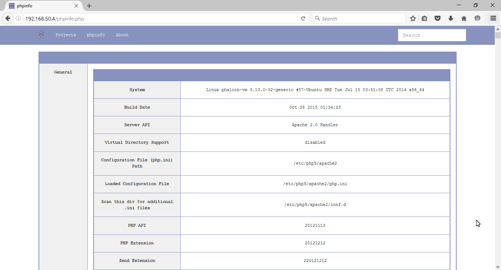
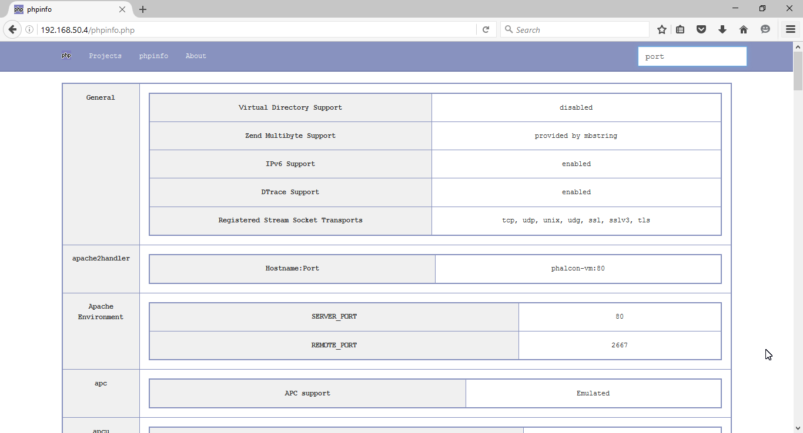
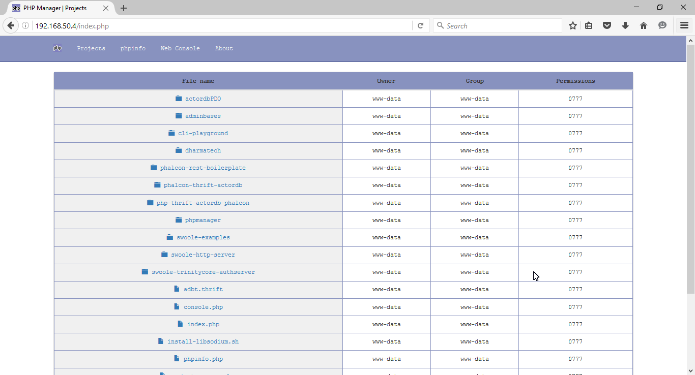
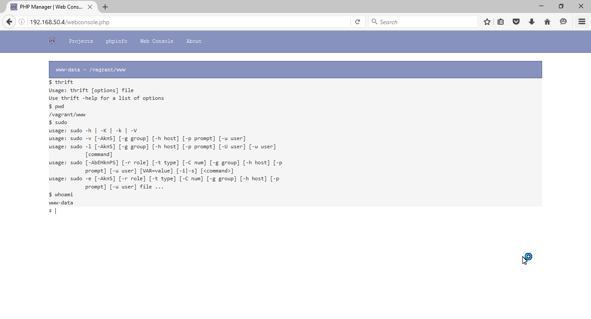

# PHP Vagrant Manager

A simple web interface for a PHP Vagrant development machine, this includes a simple file/folder viewer, a custom phpinfo page and a web terminal for excecuting commands to the machine directly from the browser.

The web terminal is unable to excecute sudo commands unless ```%www-data ALL=NOPASSWD: ALL``` is added to the ```/etc/sudoers``` file, this allows the web server user to run commands without asking for a password (not recommended in production enviroment).

#### Try it out!

* Just place it in your web root.

#### TODO:

* Web Console autocompletition.
* More to come.

#### The PHP Vagrant Manager uses the following projects:

* [phpinfo](https://github.com/kenpb/phpinfo)
* [php-terminal-emulator](https://github.com/spyrosoft/php-terminal-emulator)

#### Screenshots




